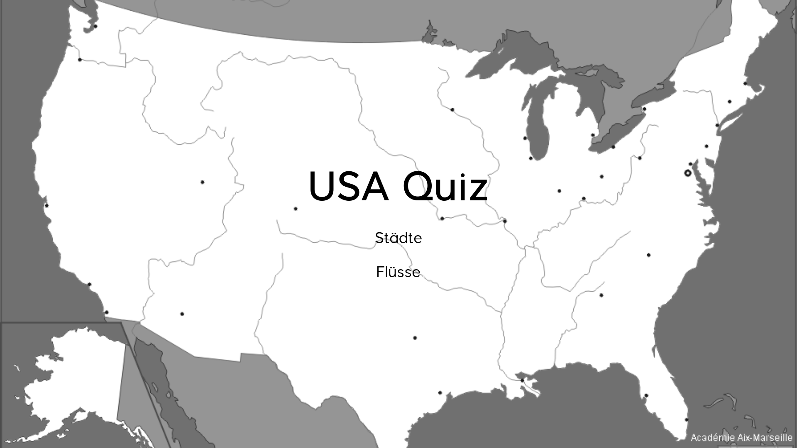

<a name="readme-top"></a>

<p align="center">
  <a href="https://github.com/adkoprek/USA/graphs/contributors">
	  
  </a>
  <a href="https://github.com/adkoprek/USA/network/members">
	  
  </a>
  <a href="https://github.com/adkoprek/USA/stargazers">
	  
  </a>
  <a href="https://github.com/adkoprek/USA/issues">
	  
  </a>
  <a href="https://github.com/adkoprek/USA/blob/master/LICENSE.txt">
	  
  </a>
</p>


<br />
<div align="center">
  <a href="https://github.com/adkoprek/USA">
    
  </a>

  <h3 align="center">USA - An Interactive Quiz</h3>

  <p align="center">
    An awesome website to check you knowledge about some US cities and rivers
    <br />
    <a href="https://dynamic-malabi-7bd9ba.netlify.app">View Website</a>
    ·
    <a href="https://github.com/adkoprek/USA/issues/new?labels=bug&template=bug-report---.md">Report Bug</a>
    ·
    <a href="https://github.com/adkoprek/USA/issues/new?labels=enhancement&template=feature-request---.md">Request Feature</a>
  </p>
</div>

<!-- ABOUT THE PROJECT -->
## About The Project

<p align="center">
  
</p>

This a website that I created for my school to train for the geography exam about the US but it's open to everyone

### Built With

[![HTML][HTML.js]][HTML-url]
[![CSS][CSS.js]][CSS-url]
[![JavaScript][JavaScript.js]][JavaScript-url]

<!-- GETTING STARTED -->
## Getting Started

If you want your own copy just follow this steps

```bash
git clone https://github.com/adkoprek/USA
```

### Prerequisites

A browser

## Usage

You can open this website over this [link](https://dynamic-malabi-7bd9ba.netlify.app)

## Contributing

Contributions are what make the open source community such an amazing place to learn, inspire, and create. Any contributions you make are **greatly appreciated**.

If you have a suggestion that would make this better, please fork the repo and create a pull request. You can also simply open an issue with the tag "enhancement".
Don't forget to give the project a star! Thanks again!

1. Fork the Project
2. Create your Feature Branch (`git checkout -b feature/AmazingFeature`)
3. Commit your Changes (`git commit -m 'Add some AmazingFeature'`)
4. Push to the Branch (`git push origin feature/AmazingFeature`)
5. Open a Pull Request

## License

Distributed under the MIT License. See `LICENSE.txt` for more information.

## Contact

Adam Korpek - adam.koprek@edu.schulen-Turgi.ch

[HTML.js]: https://img.shields.io/badge/HTML5-E34F26?style=for-the-badge&logo=html5&logoColor=white
[HTML-url]: https://html.com
[CSS.js]: https://img.shields.io/badge/CSS3-1572B6?style=for-the-badge&logo=css3&logoColor=white
[CSS-url]: https://css.com
[JavaScript.js]: https://img.shields.io/badge/JavaScript-323330?style=for-the-badge&logo=javascript&logoColor=F7DF1E
[JavaScript-url]: https://en.wikipedia.org/wiki/CSS
[JQuery.com]: https://img.shields.io/badge/jQuery-0769AD?style=for-the-badge&logo=jquery&logoColor=white
[JQuery-url]: https://jquery.com 
